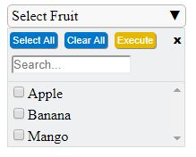

## Jquery plugins in the repo

- Multiselect dropdown
- Custom Context Menu

## MultiSelect Dropdown

This is a jquery plugin to create multiselect html dropdown

### Usage

```javascript
$("#testDiv").multiselect();
```

Following configuration options are available:

- "label": set a label for the control
- "dropdownList": set the list of string choices to be dispayed in the dropdown
- "showExecuteButton": set the boolean option to true to display "Execute" button
- "executeSelected": set the function to be executed when the "Execute" button is clicked
  - function receives an array parameter containing the selected list values

### Example

```javascript
$("#testDiv").multiselect({
  label: "Select Fruit",
  dropdownList: ["Apple", "Banana", "Mango"],
  showExecuteButton: true,
  executeSelected: function(selectedValues) {
    alert("I selected " + selectedValues.length + " options");
  }
});
```



## Custom Context Menu
